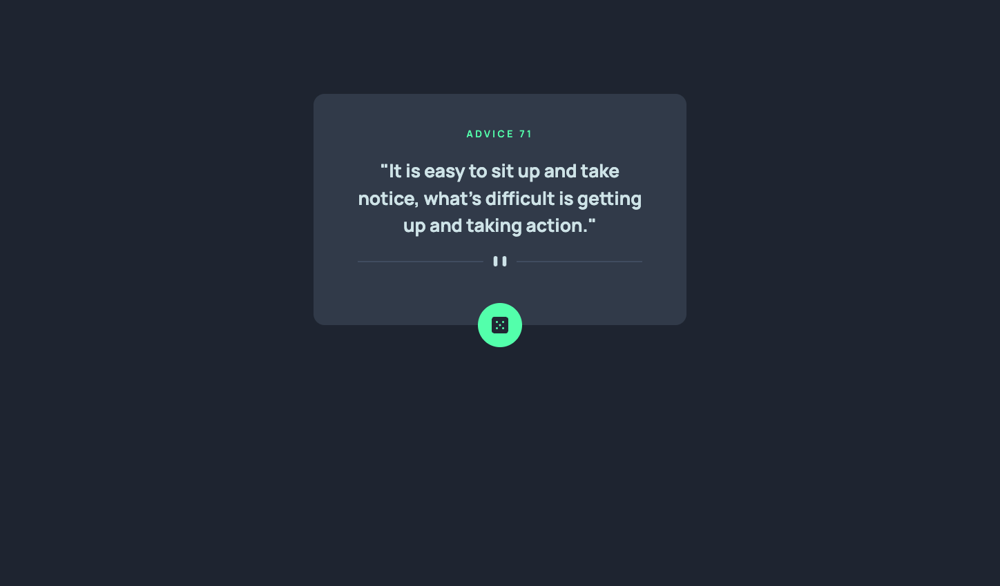

# Frontend Mentor - Advice generator app solution

This is a solution to the [Advice generator app challenge on Frontend Mentor](https://www.frontendmentor.io/challenges/advice-generator-app-QdUG-13db). Frontend Mentor challenges help you improve your coding skills by building realistic projects.

## Table of contents

- [Overview](#overview)
  - [The challenge](#the-challenge)
  - [Screenshot](#screenshot)
  - [Links](#links)
- [Built with](#built-with)
- [Continued development](#continued-development)
- [Author](#author)

## Overview

### The challenge

Users should be able to:

- View the optimal layout for the app depending on their device's screen size
- See hover states for all interactive elements on the page
- Generate a new piece of advice by clicking the dice icon

### Screenshot

### Links

- Live Site URL: [Vercel Live Site](https://advice-generator-app-main-azure.vercel.app/)

### Built with

- Semantic HTML5 markup
- CSS custom properties
- Mobile-first workflow
- [SvelteKit](https://kit.svelte.dev/)
- [Tailwindcss](https://tailwindcss.com/)

### Continued development

The [Adviceslip API](https://api.adviceslip.com) has a few more endpoints that would be neat to implement. Given time constraints, I'll add those to this challenge.

## Author

- Frontend Mentor - [@YourFavoriteKyle](https://www.frontendmentor.io/profile/YourFavoriteKyle)
